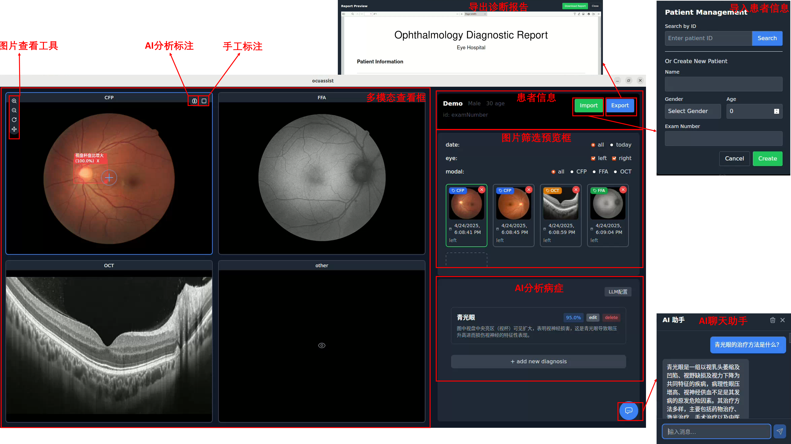

# OcuAssist - AI辅助眼底多模态诊断系统

OcuAssist是一款基于Tauri框架开发的AI辅助眼底多模态诊断软件，集成了AI辅助探测、AI辅助诊断和AI对话等功能，为眼科医生提供智能化的诊断支持。



## ✨ 功能特点

- **AI辅助探测**：自动识别眼底图像中的异常区域
- **AI辅助诊断**：基于多模态数据提供诊断建议
- **AI对话系统**：通过自然语言交互解答眼科相关问题
- **患者信息管理**：记录和管理患者基本信息及诊断历史
- **图像查看器**：支持多种眼底图像格式的查看和分析

## 🛠️ 技术栈

- **前端**：React + TypeScript + TailwindCSS
- **后端**：Rust (Tauri框架)
- **AI模型**：集成多种眼底图像分析模型
- **构建工具**：Vite

## 🚀 安装指南

### 系统要求
- Node.js v16+
- Rust 1.70+
- 支持的操作系统：Windows/macOS/Linux

### 安装步骤
1. 克隆仓库：
   ```bash
   git clone https://github.com/ji2814/OcuAssist.git
   ```
2. 安装依赖：
   ```bash
   cd OcuAssist
   npm install
   ```
3. 开发模式运行：
   ```bash
   npm run tauri dev
   ```
4. 生产构建：
   ```bash
   npm run tauri build
   ```

## 📖 使用说明

1. 启动应用后，导入患者信息和眼底图像
2. 使用AI辅助探测功能标记异常区域
3. 查看AI生成的诊断报告
4. 通过AI对话系统获取更多诊断建议
5. 保存诊断结果和患者记录

## 🧑‍💻 开发指南

### 项目结构
```
OcuAssist/
├── src/                  # 前端源代码
│   ├── components/       # React组件
│   ├── context/          # 状态管理
│   ├── types/            # TypeScript类型定义
│   └── util/             # 工具函数
├── src-tauri/            # Tauri后端代码
│   └── src/              # Rust源代码
```

### 开发命令
- 启动开发服务器：`npm run dev`
- 运行Tauri应用：`npm run tauri dev`
- 构建生产版本：`npm run tauri build`

## 📄 许可证

本项目采用 [MIT License](LICENSE)

## 🤝 贡献指南

欢迎提交Pull Request或Issue报告问题。

## 📧 联系方式

如有问题请联系：support@ocuassist.com
